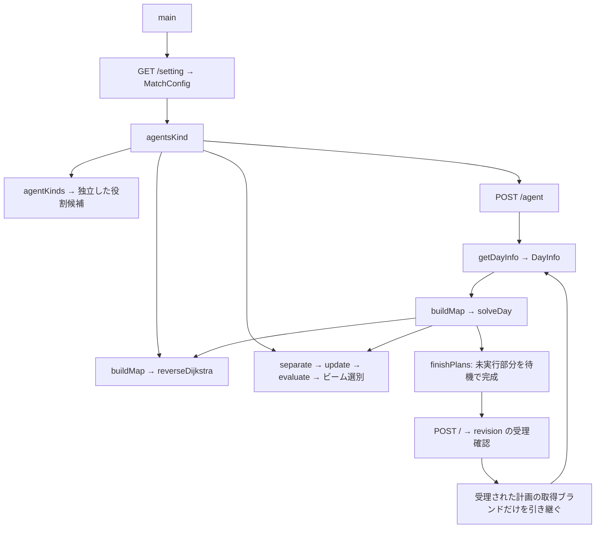

# 状態管理・役割決定のレビューと検証記録

検証日: 2026-10-09（日本時間）。対象は配布された6ファイルです。このフォルダには `.git`、remote、仕様書、テスト、サーバーソースがありません。元のZIPのコメントに記録されたコミットIDは `6c1430932303be23c2ada7923331f4b1ef77daa7` です。リポジトリURLは特定できていないため、GitHubへのPR作成・push・commitは行っていません。修正済みファイル、適用用差分、PR本文を用意しています。

## 1. 呼び出し関係と状態のライフサイクル



- `main()` は設定取得、役割提出、各日の状態取得・探索・行動提出を行います。JSON変換関数は公式レスポンスを `MatchConfig` と `DayInfo` に取り込みます。
- `agentsKind()` は補給車数を `N/3`～`N/2`（整数除算、両端を含む）として全ビット列を列挙し、初日の探索結果で役割を選びます。範囲は維持しました。
- `solveDay()` は公式の位置・燃料・役割を起点に、最大幅3000のビームで日単位の計画を作ります。各ステップで、キューの先頭がそのステップに達するまで候補を展開し、低い評価値から削除します。
- `separate()` は行動が未定の1台について、スポット・相手役割の車への経路、および待機を分岐します。移動中は新しい経路を作らず、到着反映後に実際の位置・燃料で分岐します。
- `update()` は現在ステップの行動を予約し、ステップを進めて次の反映フェーズを適用します。全車の燃料消費・到着を反映した後、うどん取得、補給を行います。この表現により、初期状態は0ステップの反映前、以後の状態はそのステップの反映済み状態となります。最終ステップの到着・取得・補給も評価対象になります。
- `evaluate()` は過去日の取得ブランドと当該候補の取得ブランドの和集合、当日ブランド数、玉数、平均燃料、最寄りスポットへの近さを評価します。重みは `{10000,10000,10000,1,100}` のままです。

| データ | 所有・コピー | 候補間の扱い |
|---|---|---|
| `State::spotMgr` と在庫 | 値コピー | 各候補で独立 |
| `State::agentMgr`、役割・台数・位置・燃料 | 値コピー | 各候補で独立 |
| `actions`、`history`、`visitedSpotPos`、移動予約 | エージェント内で値コピー | 各候補で独立 |
| `udonSum`、`udonBrand`、`step`、`score` | State内 | 当日・当該候補だけの結果 |
| `brands` | mainが保持、探索へconst参照 | 受理済み計画の過去日結果。探索から変更不可 |
| Map、Dijkstra結果、重み、設定 | 探索間で参照 | 呼び出し先では経路・評価用に読み取りのみ |

日ごとに在庫と訪問履歴を作り直し、位置・燃料は毎日の公式レスポンスを優先します。これは在庫が日初に補充され、同じ巡回車でも翌日は再取得できるという仕様と一致します。

## 2. 修正前の再現と原因

ソースを書き換える前に原本を一時ディレクトリへ保存し、最小テストを実行しました。最終の回帰テストもその原本で実行し、13件の失敗を確認しています。新しいテストだけで通るようにするための本体変更は原本に加えていません。元の余分な `<nlohmann/json.hpp>` includeを満たすコピーだけをテスト用includeディレクトリへ置いています。

| 問題 | 最小の再現条件 | 修正前の結果 | 期待と原因 |
|---|---|---|---|
| 二重の補給車指定 | 1台に `decideSupply(0)` を2回 | 巡回-1、補給2 | 巡回0、補給1。既存のkindを確認せず台数を更新 |
| 役割候補の混入 | 6台、0探索ステップで `agentsKind()` | 選ばれた候補の補給台数カウンタが8 | 補給2～3台。候補をまたいで同じAgentManagerを変更 |
| 末尾0の欠落 | 3台、ビット列 `100`、または `000` | ビット列生成が1桁、または0桁で終了 | 3桁を保持。`while (num != 0)` が桁数を保証しない |
| ブランド・兄弟候補の評価への混入 | 同一StateをA/BへコピーしAだけ取得 | 外部brandsにAのブランドが追加され、Bの評価も変化 | 外部・Bは不変。`collectUdon(std::set<int>&)` が参照先にinsert |
| 古い評価 | 平地2セル、0→1の移動が2ステップ目に完了、セル1にスポット | 出力評価10160、取得0。到着未反映と評価漏れ | 最終到着・取得後は約40009.003。`update()` 後に再評価せずpush |
| 小数評価の消失 | 3巡回車の燃料合計1と2、他の評価項目は同じ | 平均燃料1/3と2/3の差が失われる | 評価が異なる。intのscoreへdoubleを逐次加算 |
| 移動中の空キュー | 平地0→1を開始し、actionsを消費した次ステップ | `update()` がfalseで移動を進められない | 移動予約があれば更新可能。先頭で全台の空キューを拒否 |
| 移動元を使った新経路 | 0→1を予約中、空キュー、目的スポット2 | 新経路の先頭が1。到着後は1→1の不正な移動 | 到着後に位置1から生成。`separate()` が予約を考慮せずposを使用 |
| 不正方向の予約 | 3セルの直線で0→2を直接キューへ入れる | historyの-1が待機に見える一方、内部では2への移動を予約 | 不正移動を予約しない。`getDirection()` の-1を未検査 |
| 燃料不足 | 燃料0、平地0→1をキューへ入れる | 移動を予約し、後に負の燃料へ進みうる | 補給まで待機。更新時の燃料検査なし |
| 最終ステップ・処理順 | 公式Q6の8台・6ステップの例 | 最終結果が公式例と不一致 | 到着、消費、取得、補給を公式の順で反映 |
| 六角格子の偶奇 | 3×2マップ、偶数行セル1からSE | セル4へ移動 | セル5。既存DIR_TABLEは奇数行が右へずれる配置 |
| 時間予算 | 同一8×8条件、探索予算0.5秒 | 約1.431秒で終了。不受理の計画を返す | 期限チェックで中断し、待機を足した有効な計画を返す |
| HTTP 200での不受理 | `{"revision":-1}` を返すHTTPモック | HTTPステータスだけでは成功扱い | 不受理を検出しブランドを確定しない。公式APIが負のrevisionを定義 |

台数の合計だけは元の実装でも増減が相殺されるため、二重計上を検出できません。テストでは合計に加え、実際のkindから数えた台数、各カウンタ、非負性、補給数の探索範囲を確認しました。

## 3. 変更の範囲と理由

| ファイル | 必要な変更 |
|---|---|
| `agent.cpp` | 補給車への重複指定を無視し、台数とkindを一致させる |
| `state.cpp` | 外部ブランド更新を除去し候補内だけで取得を管理。評価時に和集合を数える。scoreをdoubleへ変更。移動中は分岐を遅らせ、空キューでも進行。最終反映とフェーズ順を修正。無効方向・池・燃料不足を待機にする |
| `map.cpp` | 公式の偶奇行へ方向表を修正。範囲外座標の方向を拒否。Dijkstra中にも期限を確認 |
| `hexudon_main.cpp` | 固定桁の役割候補、候補ごとのAgentManager、初期・更新後の評価、期限確認、待機による中断計画の完成。受理済み計画のブランドだけを日越し。HTTPの期限とrevision判定。ローカルjson.hppに加えて外部includeを要求していた重複includeを除去 |
| `tests/` | 最小回帰ケース、JSON入出力ドライバー、独立した公式行動再生、HTTPモック、任意の公式サーバー実行テスト |

`json.hpp` と `spot.cpp` は変更していません。SHA-256の一致を確認しました。探索の目的地候補、最大ビーム幅、キュー比較順、通常時のビーム幅調整式、補給台数の探索範囲、評価重みを維持しています。浮動小数のビーム幅計算は整数へ変換する前に範囲を制限し、大きな時間予算での不適切な変換も避けました。

## 4. 公式仕様の確認

参照した一次資料は次のとおりです。PDFはテキスト抽出に加え、格子図・地形コスト表を画像で確認しました。

- [募集要項](https://www.procon.gr.jp/uploads/download/Bbh9vPjAVAA): マップ図、地形コスト、在庫補充、訪問制限、勝敗判定。
- [Q&Aその1](https://www.procon.gr.jp/uploads/download/BcAnkyvgVAA): Q1（偶数行が右）、Q6～Q8（処理順・0ステップ・再取得）、Q10～Q11（移動元コスト）。
- [Q6行動詳細](https://www.procon.gr.jp/uploads/download/BcAnkz3QVAA): 0ステップは行動のみ、最終ステップは反映のみ。8台の公式例をテストへ移植。
- [Q&Aその2](https://www.procon.gr.jp/uploads/download/BcgLrQEgVAA): Q22（同時移動と補給）、Q25（移動前の地形）、Q26（取得のID順）、Q48（同行時の燃料）、Q50（3～8台）。
- [フォーマット](https://www.procon.gr.jp/uploads/download/BcgL66tAVAA): 日次情報、完全なステップ数、方向0～5と負の待機、提出配列。
- [公式簡易サーバー・API公開案内](https://www.procon.gr.jp/news/2026/08/20/117)と[配布ZIP](https://www.procon.gr.jp/uploads/media/BecQtyfAVAA): APIは取得ブランドを公開しない。`startsAt=0` は未確定。行動の受理は `revision>=0`。配布は実行ファイルとHTMLのOpenAPIで、ゲーム処理のソースは含まれない。

移動元の地形コストは正しいので変更しませんでした。在庫は自チームだけで管理されるため、取得ブランドは受理された計画と公式の処理順から再現できます。ただし、これは公式APIから直接取得したブランド実績ではありません。公式レスポンスに存在しないフィールドは追加していません。

## 5. テスト結果と再実行

環境はWindows / MinGW GCC 15.1.0 / C++17です。curlの開発ヘッダー・DLLが既存環境になかったため、curl.seのWindows配布を一時ディレクトリへ展開してリンクしました。本番クライアントと両テストドライバーを `-std=c++17 -O2` でコンパイルできました。標準ライブラリの境界検査を有効にした `-D_GLIBCXX_ASSERTIONS` の回帰テストも通過しています。

| 検証 | 結果 |
|---|---|
| 原本での回帰 | state / roles / solver / official の4モードで計13件の失敗を再現 |
| 修正版の回帰 | 全モード通過。ブランド・在庫・訪問履歴の分離、最新評価、小数、最終到着、移動予約、燃料、方向、圧縮形式を確認 |
| 全役割候補 | N=3～8、計273候補。桁数・重複なし・補給範囲・kindとカウンタ・合計一致を確認 |
| キュー | 同一ステップでは低評価を削除。異なるステップでは早いステップを展開 |
| 公式Q6例 | 8台の最終位置、燃料、取得4玉、在庫0、同時取得のID優先が一致 |
| 前計算の中断 | 32×32、予算-1/0/0.001/0.01/0.05秒。全台に32ステップ分の待機を返却。0.05秒時の実測約0.050216秒 |
| 探索中の中断 | 8×8で予算を使い切って中断。開始済み移動を完了し、未実行の経路を破棄して残りを待機。独立再生で時間・方向・燃料・取得を検査 |
| HTTPモック | URL、token、Content-Type、JSON配列を維持。200/負revision、400、50msのタイムアウトを検査 |
| 公式サーバー比較 | 修正前はrevision=-1。修正後は2日ともrevision>=0。翌日の公式位置・燃料が独立再生と一致 |
| mainの実通信 | 役割選択、2秒×2日の行動提出を全て受理。サーバーログで各日の提出が締切前であることを確認 |

libcurlがシステムにある環境:

```sh
python tests/run_tests.py
```

curl.seのWindows配布を使う場合:

```powershell
python tests/run_tests.py --curl-root 'C:\path\curl-8.22.0_3-win64-mingw'
```

修正前の6ファイルを別フォルダへ保存し、公式サーバーも使う場合:

```powershell
python tests/run_tests.py --curl-root 'C:\path\curl-8.22.0_3-win64-mingw' --baseline-dir 'C:\path\original' --official-server 'C:\path\procon-server-windows-amd64.exe'
```

テスト用ポートは8080と18080です。既存サーバーを停止・置換する処理はありません。使用中ならテストは失敗します。公式サーバーを渡さない場合、実サーバー検証は実行されません。ビルド・サーバーログは一時ディレクトリへ保存します。今回の実行記録は `output/review/test-results.txt` と同ディレクトリのサーバーログです。

## 6. 性能と制限

同一8×8マップ・同一位置・燃料・役割・32ステップ・予算0.5秒の単回測定では、原本1.431330秒、修正版0.556595秒でした。これは中断を導入したことによる処理時間の差で、探索スループットや勝率の向上を示す測定ではありません。原本が出力した13玉は不受理計画上のシミュレーション値で、競技の得点として比較できません。

探索中は期限を確認しますが、候補の選別・破棄、残りの待機の再生、JSON作成には時間が必要です。0.5秒予算で約56msの後処理超過、mainの別ケースでは約187msの超過を観測しました。65%の探索比率とHTTP用最低1秒の余裕、残り時間に制限したHTTP timeoutで提出時間を確保しています。実時間の厳密な上限を保証する実装ではありません。

Stateの値コピーは在庫・履歴・集合・行動キューも複製するので、候補が多い局面では負荷があります。最新評価の再計算も増えます。コピー構造を共有化すると今回修正した独立性に影響するため維持しました。通常の60秒回答時間、最大8台での継続的な対戦評価・メモリ計測は未実施です。

## 7. 未修正・未確認事項

- **評価重み**: 公式は「試合全体の種類数 → 日ごとの種類数の累積 → 玉数 → 回答時間」の辞書式順序です。同じ10000の重みでは、2種類2玉より1種類8玉を高く評価できます。回帰テストでこの現行方針を確認しました。重みや比較方式の変更は戦略変更になるため、この修正では行いません。
- **空在庫・訪問済みへの経路**: `separate()` は依然として経路候補を作ります。到着しても不正回答にはならず、取得関数は追加取得を抑止します。候補除外は経由・補給位置にも影響しうるため維持しました。
- **役割の独立した締切**: 公式簡易サーバーでは種類締切後にstartsAtが確定します。種類締切そのものはAPIに含まれません。startsAtが0なら探索せず既存補給範囲内の有効候補を提出します。startsAtが既知の場合は元の試合開始時刻基準を使いますが、独立した役割提出締切の保証はできません。推測した締切や新しい通信フィールドは追加していません。
- **ブランドの公式実績**: 日次情報とPOST応答には取得集合がなく、受理された計画の再生結果を保持します。公式に実績を取得するAPIは確認できません。
- **本番サーバー**: 配布された公式簡易サーバーで検証しました。本番サーバーのソースレビュー・本番接続、全公式マップ、最大条件での勝率比較は未実施です。
- **GitHub**: 元のremoteと接続権限が確認できないため、オンラインPRとコミットは未作成です。`PR_BODY.md` と適用用差分を利用できます。
